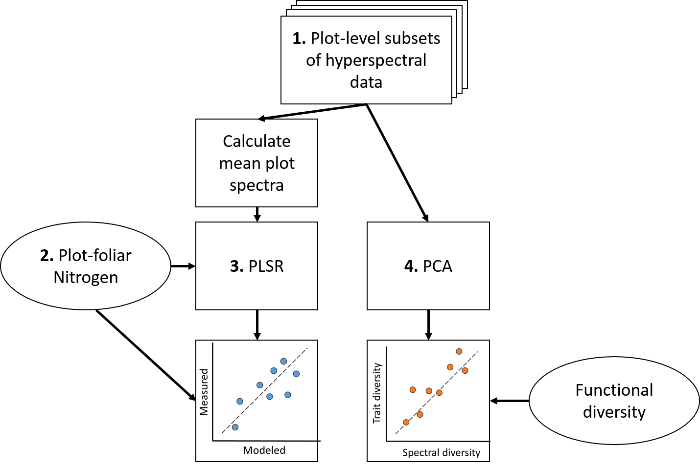
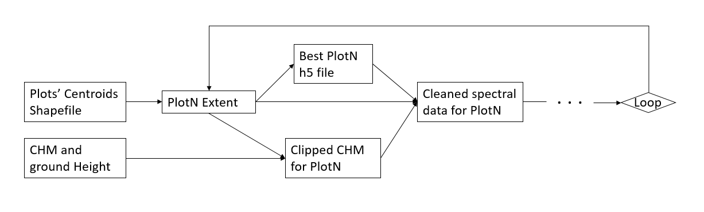
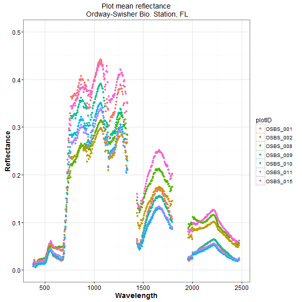
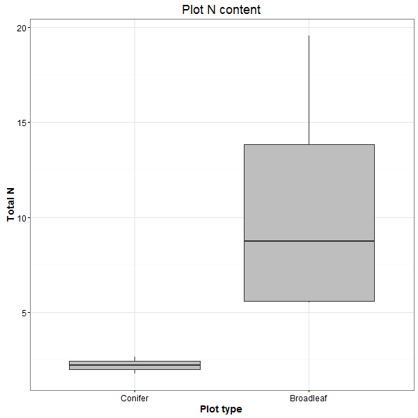
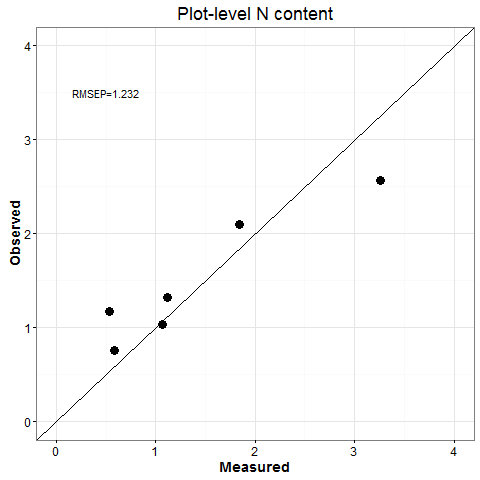

# Analysis of canopy nitrogen and functional diversity using hyperspectral imagery and LiDAR


## Overall workflow

There were 4 main steps to our analysis

1. Extract hyperspectral data for each plot
1. Calculate plot-level foliar nitrogen content
1. Build Partial Least Squares Regression model
1. Calculate plot-level functional diversity and spectral diversity



```{r intro-section}


```


# Estimating canopy N foliar mass through a combintation of remote sensing, NEON in situ data, modelling, and training data.


# Extract and process plot-level remote sensing data


## finding best h5 file

get overlap of two extents
```{r get-overlap, eval=FALSE}
overlap <- intersect(temp_ext, h5Extent)

```

check if overlap is the same as temp

```{r check-if-overlap, eval=FALSE}
if (temp_ext == overlap) {
  recordRaster[i] <- afile
  i <- i+1
} 
```

return remaining file
```{r return, eval=FALSE}
# only one file left
if (length(recordRaster) == 1) {
  returnFile <- recordRaster
  break
}

```

## Partial Least Squares Regression model

Relate plot-level nitrogen (kg) to plot-mean spectral reflectance.





### PLSR model

Use `PLSR` package

```
# model function
m1 <- plsr(N ~ refl, data=df.use, ncomp = 5, validation = "LOO")
```

